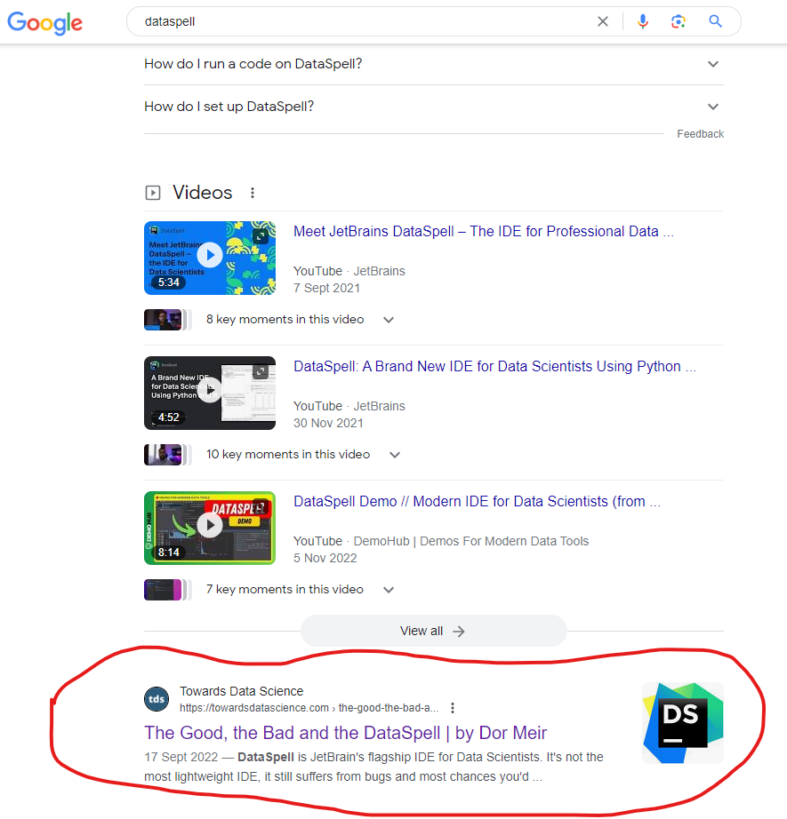
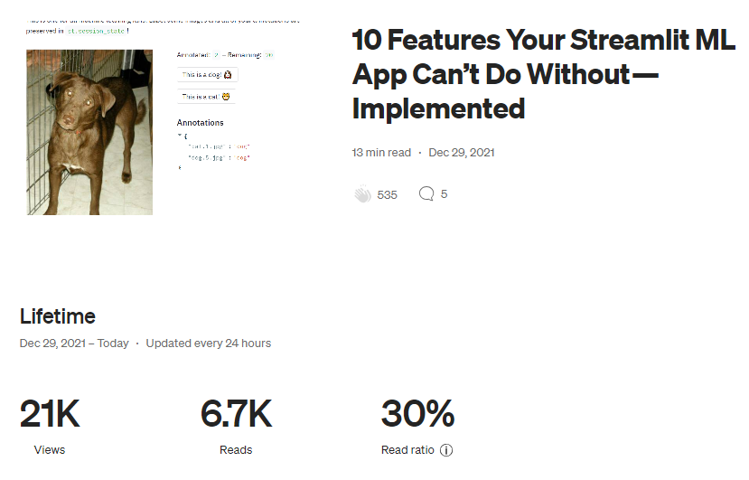

# Table of Contents
- [Accomplishments](#accomplishments)
- [GPT4 Summaries of the Papers](#gpt4-summaries-of-the-papers)
    - [Time Series: How to Beat SageMaker DeepAR with Random Forest](#time-series-how-to-beat-sagemaker-deepar-with-random-forest)
    - [10 Features Your Streamlit ML App Can’t Do Without — Implemented](#10-features-your-streamlit-ml-app-cant-do-without--implemented)
    - [The Good, the Bad and the DataSpell](#the-good-the-bad-and-the-dataspell)
- [Summaries for My Other Articles, Posted in Towards AI and Data-Driven Fiction](#summaries-for-my-other-articles-posted-in-towards-ai-and-data-driven-fiction)
    - [Who’s The Best Free Chatbot? ChatGPT vs. Bing Chat vs. Bard](#whos-the-best-free-chatbot-chatgpt-vs-bing-chat-vs-bard)
    - [Can ChatGPT Think? An answer from Leibowitz, Yovell, and ChatGPT](#can-chatgpt-think-an-answer-from-leibowitz-yovell-and-chatgpt)
    - [Will AI Kill Us All? GPT4 Answers to Yudkowsky](#will-ai-kill-us-all-gpt4-answers-to-yudkowsky)
    - [MJ vs. LBJ — who’s the GOAT? A rational answer by Bing Chat](#mj-vs-lbj--whos-the-goat-a-rational-answer-by-bing-chat)
  
# Accomplishments

* [The Good, the Bad and the DataSpell](https://towardsdatascience.com/the-good-the-bad-and-the-dataspell-a86fec8fd6e1) is first result in Google after the official Jetbrains website:

* [Time Series: How to Beat SageMaker DeepAR with Random Forest](https://towardsdatascience.com/how-to-beat-sagemaker-deepar-with-random-forest-a358f115841f) has 38% read ratio (a good Medium read ratio is generally between 20 and 50%): 

* [10 Features Your Streamlit ML App Can’t Do Without — Implemented](https://towardsdatascience.com/10-features-your-streamlit-ml-app-cant-do-without-implemented-f6b4f0d66d36) has a 30% read ratio, and is my most viewed article.

* 

# GPT4 summaries of the papers

## [Time Series: How to Beat SageMaker DeepAR with Random Forest](https://towardsdatascience.com/how-to-beat-sagemaker-deepar-with-random-forest-a358f115841f)

The article titled "Time Series: How to Beat SageMaker DeepAR with Random Forest" by Dor Meir discusses how to outperform the SageMaker DeepAR model using a Random Forest approach. It outlines strategies for improving model performance on time series data, emphasizing the importance of understanding the tools used, addressing data gaps, defining clear objectives, and adopting the correct perspective. The author describes various techniques such as using Groupby operations, handling missing data, and feature engineering to enhance the model. The article argues that with the right data manipulation and model training, it's possible to achieve better results than DeepAR, with added benefits of speed, cost-effectiveness, and interpretability.

## [10 Features Your Streamlit ML App Can’t Do Without — Implemented](https://towardsdatascience.com/10-features-your-streamlit-ml-app-cant-do-without-implemented-f6b4f0d66d36)

The article "10 Features Your Streamlit ML App Can't Do Without — Implemented" by Dor Meir provides a practical guide on enhancing a Streamlit ML application with essential features. It addresses common limitations and offers solutions such as session management to preserve work, methods for saving user progress, file exploration capabilities, authentication systems, multi-page app structure, parallel computation techniques, handling different Python environments, dynamic result plotting, Jupyter notebook integration, and deploying trained models. These implementations are crucial for professional, user-friendly ML applications in Streamlit.

## [The Good, the Bad and the DataSpell](https://towardsdatascience.com/the-good-the-bad-and-the-dataspell-a86fec8fd6e1)

The article "The Good, the Bad, and the DataSpell" by Dor Meir is an honest review of JetBrains' Data Science IDE, DataSpell, after a year of use. The author highlights three main issues: high resource usage, unresolved bugs, and the cost of the IDE. Despite these drawbacks, the article also outlines three significant benefits: a comfortable data view, enhanced Jupyter features, and the convenience of an all-in-one tool for data research and development. DataSpell enhances the data science workflow by integrating the interactive and graphical strengths of Jupyter with the efficient coding features of PyCharm. Overall, the author suggests that the benefits of DataSpell outweigh its issues.

# Summaries for my other articles, posted in Towards AI and data-driven fiction

## [Who’s The Best Free Chatbot? ChatGPT vs. Bing Chat vs. Bard](https://pub.towardsai.net/whos-the-best-free-chatbot-f0f7c88d7caf)

The article "Who’s The Best Free Chatbot?" by Dor Meir evaluates ChatGPT, Bing Chat, and Bard based on several criteria: general intelligence, connectivity to the outside world, memory, additional capabilities, and reliability. The author shares their personal experiences and experiments with each chatbot, ultimately finding that Bing Chat, particularly in Creative mode, excels in intelligence, connectivity, and additional features. ChatGPT wins in memory with its long-term conversation recall, while Bard is noted for reliability and accessibility but still has room for improvement. The article concludes that Bing Chat stands out as the top choice for its precise responses and innovative features.

## [Can ChatGPT Think? An answer from Leibowitz, Yovell, and ChatGPT](https://pub.towardsai.net/can-chatgpt-think-7590de6744b4)

The article "Can ChatGPT Think? An answer from Leibowitz, Yovell, and..." by Dor Meir explores the philosophical and scientific perspectives on whether AI, specifically ChatGPT, possesses the ability to think. It delves into the mind-brain problem, discussing various philosophical approaches like epiphenomenalism and functionalism, and examines experimental evidence from neuropsychology. The article contemplates whether the mental capabilities of AI, such as understanding and logical reasoning, are genuine forms of thinking or mere simulations. This exploration raises fundamental questions about consciousness, free will, and the nature of thought in both humans and AI.

## [Will AI Kill Us All? GPT4 Answers to Yudkowsky](https://medium.com/data-driven-fiction/will-ai-kill-us-all-gpt4-answers-to-yudkowsky-f0da21c8e44c)

The article "Will AI Kill Us All? GPT-4 Answers to Yudkowsky" engages with the ideas of prominent AI researcher Eliezer Yudkowsky, particularly his concerns about superintelligent AI posing an existential threat to humanity. The author presents a dialogue with GPT-4, exploring various scenarios and responses related to AI alignment and potential risks. The discussion includes strategies to ensure AI systems align with human values and interests, emphasizing transparency, regulation, and cooperative development approaches. The article suggests that with careful design and ethical guidelines, AI can be developed to augment human abilities rather than oppose them.

## [MJ vs. LBJ — who’s the GOAT? A rational answer by Bing Chat](https://medium.com/data-driven-fiction/mj-or-lbj-whos-the-goat-an-answer-by-bing-chat-6e617d29cbef)

The article "MJ vs. LBJ — Who's the GOAT? A rational answer by Bing Chat" compares Michael Jordan (MJ) and LeBron James (LBJ) across various basketball performance criteria to determine the greatest of all time (GOAT). Criteria include championships, MVPs, scoring, and more. MJ scores slightly higher overall, but LBJ leads in assists, longevity, and versatility. The article emphasizes that the GOAT debate is subjective, influenced by personal biases and contexts, and concludes by celebrating both players as legends who have left a lasting impact on basketball.
